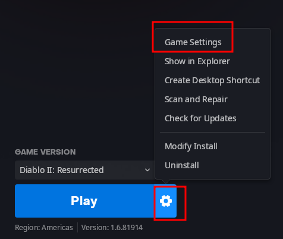
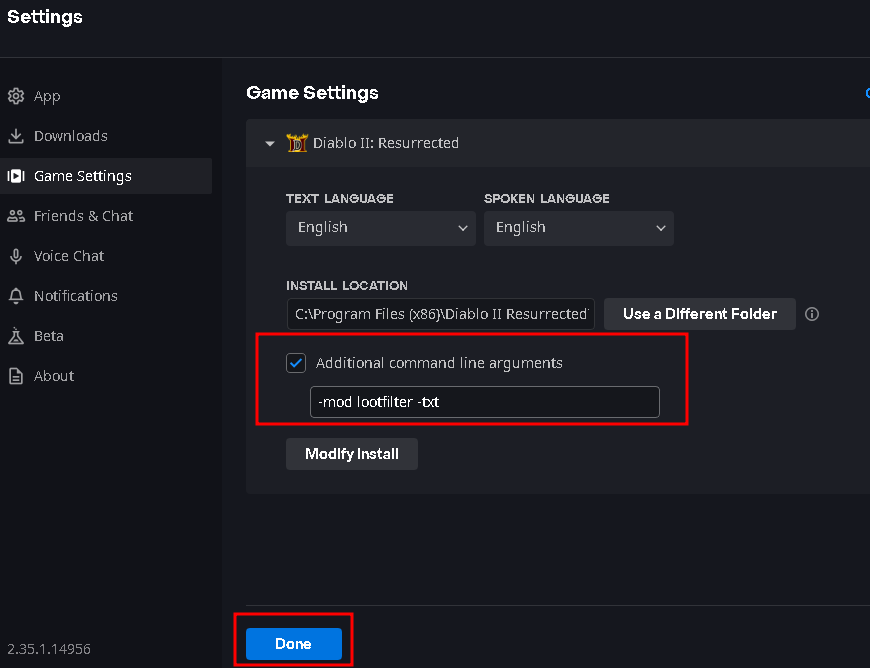

## Chris Titus Tech's Diablo II Ressurected Loot Filter

This is a loot filter for Diablo II Resurrected. It's designed to be a simple, clean, and easy to read loot filter that highlights the most important items. Works on battle.net and single player.

No frills, no config, just highlights high runes and other valuable items.

### Installation

Extract the contents of the zip file to your Diablo II Resurrected folder. The path should look like this:

```
C:\Program Files (x86)\Diablo II Resurrected\mods\
```

Path structure after extraction:

```
C:\Program Files (x86)\Diablo II Resurrected\mods\lootfilter\lootfilter.mpq\
```

### Usage

Enable the filter by adding `-mod lootfilter -txt` to your Diablo II Resurrected game settings.




