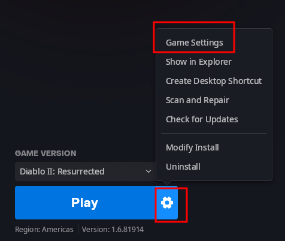
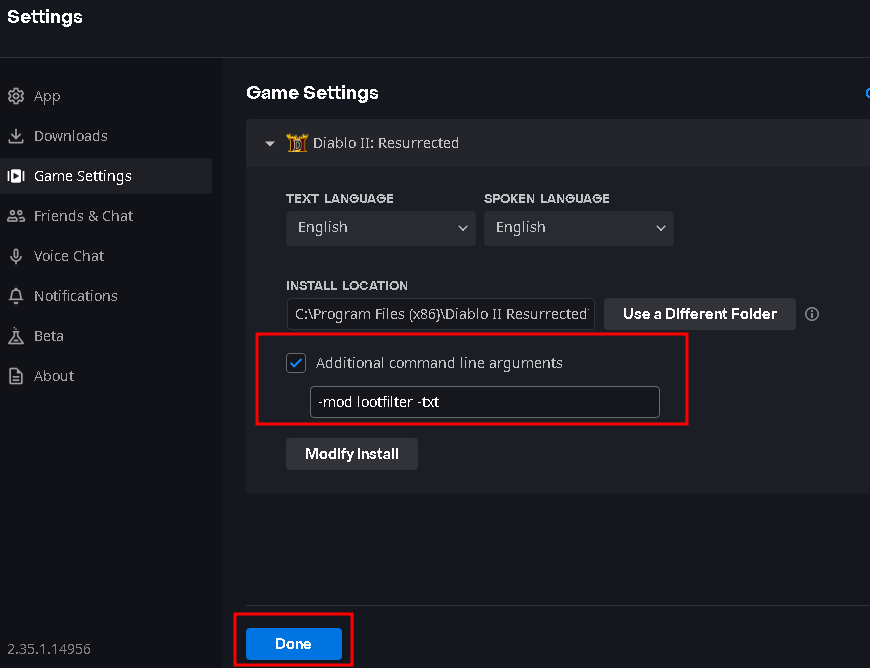

## Chris Titus Tech's Diablo II Resurected Loot Filter

This is a loot filter for Diablo II Resurrected. It's designed to be a simple, clean, and easy to read loot filter that highlights the most important items. Works on battle.net and single player.

 - No frills, no config, just highlights high runes and other valuable items.
 - No Error Speech (I can't use this, I'm full, I'm out of mana)
 - Cleaned up UI with a good EXP bar

### Installation

Use the Windows Installer to auto-install everything, but you check the **USAGE** section. TLDR; Enable the filter by adding `-mod lootfilter -txt` to your Diablo II Resurrected game settings.

Extract the contents of the zip file to your Diablo II Resurrected folder. The path should look like this:

```
C:\Program Files (x86)\Diablo II Resurrected\mods\
```

Path structure after extraction:

```
C:\Program Files (x86)\Diablo II Resurrected\mods\lootfilter\lootfilter.mpq\
```

### Usage

Enable the filter by adding `-mod lootfilter -txt` to your Diablo II Resurrected game settings.





### Installer Build Details

*Note: Most users DO NOT want this! IT IS FOR DEVELOPERS!*

The Windows installer lives in [installer/D2RInstaller.csproj](installer/D2RInstaller.csproj) and is a WinUI 3 desktop app.
The GUI is started by [installer/App.cs](installer/App.cs) and the generated WinUI entry point using the `Microsoft.WindowsAppSDK` dependency declared in [installer/D2RInstaller.csproj](installer/D2RInstaller.csproj).

### Building Dependencies

Install the required tools with winget:

```powershell
winget install --id Microsoft.DotNet.SDK.10 --exact --accept-package-agreements --accept-source-agreements
winget install --id Microsoft.VisualStudio.2022.Community --exact --accept-package-agreements --accept-source-agreements
```

Why Visual Studio is required:

WinUI 3 desktop builds depend on AppX/MSIX MSBuild task assemblies such as `Microsoft.Build.AppxPackage.dll` and `Microsoft.Build.Packaging.Pri.Tasks.dll`. Those tasks are provided by the Visual Studio installation, not by the standalone .NET SDK.

Build the installer from the repository root:

```powershell
cd installer
dotnet build D2RInstaller.csproj
```
